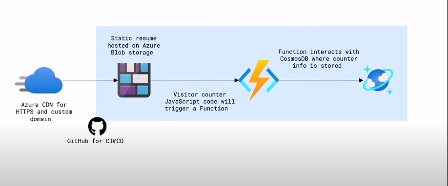

# Meu currículo na Azure

Este é meu Cloud Resume Challenge feito no Azure. Um website estático hospedado no Azure Storage, com um contador feito no Azure Functions. O website foi feito utilizando HTML5, CSS3 e Javascript. O contador de visitas foi feito utilizando .NET e Azure Functions. O valor do contador é salvo no Azure Cosmos DB NoSQL.

## Structure

- `frontend/`: Pasta que contém o website estático.
    - `main.js`: Pasta que contém o código do contador de visitas.
- `api/`: Pasta que contém a API dotnet que foi feita o deploy no Azure Functions.
    - `Counter.cs`: Arquivo que contém o código do contador de visitas.
- `.github/workflows/`: Pasta que contém o as configurações de workflow da esteira de CI/CD.

## Frontend resources

O front-end é um site estático feito em HTML5, CSS3 e Javascript. É estático e possui um contador de visitas. O contador de visitas faz uma requisição HTTP para uma API no Azure Functions, podendo rodar localmente ou em produção.

- Não tenho habilidades de design, então usei esse template [template](https://www.styleshout.com/free-templates/ceevee/) para criar o site. 
- Como fazer um [deploy de um site estático no blob storage.](https://docs.microsoft.com/en-us/azure/storage/blobs/storage-blob-static-website-host)

## Backend resources

O Back-end é uma [HTTP triggered Azure Functions](https://docs.microsoft.com/en-us/azure/azure-functions/functions-bindings-http-webhook-trigger?tabs=csharp) com um Cosmos DB input e output binding. A Function é chamada, retorna um dado do Cosmos DB, adiciona em 1 ao valor, e salva o valor no banco e retorna o valor para a requisição.

- [Criar uma Cosmos DB account](https://docs.microsoft.com/en-us/azure/cosmos-db/create-cosmosdb-resources-portal)
- [Criar uma HTTP triggered Azure Function no VsCode.](https://docs.microsoft.com/azure/azure-functions/functions-develop-vs-code?tabs=csharp)
- [Azure Functions Cosmos DB bindings](https://docs.microsoft.com/en-us/azure/azure-functions/functions-bindings-cosmosdb-v2)
- [Retrieve a Cosmos DB item with Functions binding.](https://docs.microsoft.com/azure/azure-functions/functions-bindings-cosmosdb-v2-input?tabs=csharp)
- [Write to a Cosmos DB item with Functions binding.](https://docs.microsoft.com/azure/azure-functions/functions-bindings-cosmosdb-v2-output?tabs=csharp)
- [Habilitar CORS para o Azure Functions local](https://learn.microsoft.com/azure/azure-functions/functions-develop-local#local-settings-file) 
- [Habilitar CORS para o Azure Functions depois do Deploy](https://docs.microsoft.com/azure/azure-functions/functions-how-to-use-azure-function-app-settings?tabs=portal#cors)

## CI/CD Resources

- [GitHub actions.](https://docs.microsoft.com/azure/storage/blobs/storage-blobs-static-site-github-actions)
- [deploy de uma Azure Function para o Azure com GitHub Actions.](https://github.com/marketplace/actions/azure-functions-action)

## TO DO

- Implementar testes no backend e na esteira de CI/CD.
- Criar arquivos de IaC (Terraform & Ansible).
